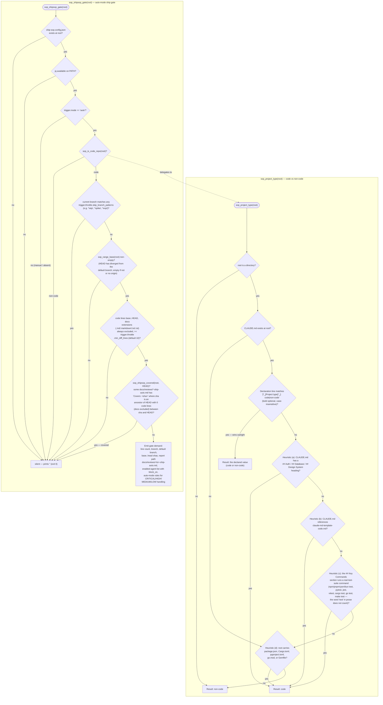

<!-- generated by diagram-builder on 2026-09-04 -->
# P102 — project-type detection and the ship-sop auto gate

Source: `scripts/hooks/sop-lib.sh` (`sop_project_type`, `sop_is_code_repo`, `sop_shipsop_gate`, `sop_code_lines`, `sop_shipsop_covered`, `sop_range_base`); config keys read from `ship-sop.config.json`.

No HTTP API exists in this repository (bash hooks and Markdown slash commands only), so the API-catalog section is skipped for this ship.

## Decision flowchart

## ARCHITECTURE delta

- `sop-stop-drift.sh` and `sop-push-gate.sh` call `sop_shipsop_gate` directly (which calls `sop_is_code_repo` → `sop_project_type`); `sop-session-context.sh` calls both `sop_project_type` and `sop_shipsop_gate` directly to populate the context block.
- `sop-project-type.sh` is the executable wrapper around `sop_project_type`, installed at `~/.claude/scripts/hooks/agent-sop/`; `/update-sop` and `/finish` shell out to it when no context block is already present in the session.
- `/restart-sop` does not call the rule itself — it reads the context block `sop-session-context.sh` already wrote (Steps 0-4), or runs its own checklist when that block is absent.
- ship-sop's `/ship` reads the same rule per `docs/sop/claude-agent-sop.md` and `docs/sop/compliance-checklist.md`, though `/ship`'s own source lives outside this diff.
- Why: P102 — the operator's rule (2026-09-04) is that ship-sop fires for coding and for nothing else, so every consumer above must resolve code/non-code identically or a gate nags a prose repo, or unreviewed code goes through unchecked.
